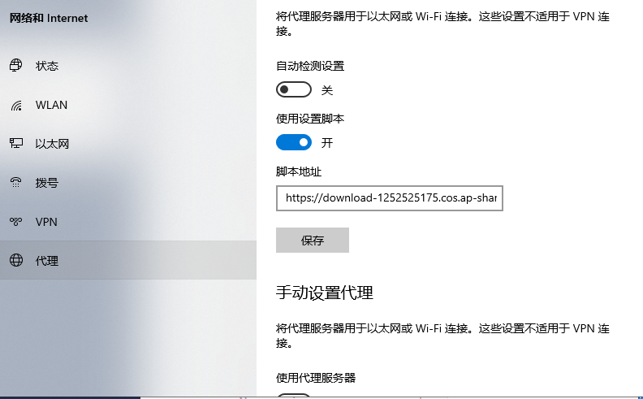

# 科学上网配置

以下内容 For win10用户

只要你在校园网环境下（连着学校VPN、或者是文博楼、3207、sfuwifi等）

可以打开电脑——设置——网络和Internet——Proxy（代理）——使用设置脚本。

**脚本地址是：**[ **https://download-1252525175.cos.ap-shanghai.myqcloud.com/PAC/zhang.pac**](%20https://download-1252525175.cos.ap-shanghai.myqcloud.com/PAC/zhang.pac)\*\*\*\*

开启使用设置脚本，同时保持手动设置代理关闭。（showdwos等软件会更改设置代理，请设为手动）

**脚本地址是：**

[ https://download-1252525175.cos.ap-shanghai.myqcloud.com/PAC/zhang.pac](%20https://download-1252525175.cos.ap-shanghai.myqcloud.com/PAC/zhang.pac)

