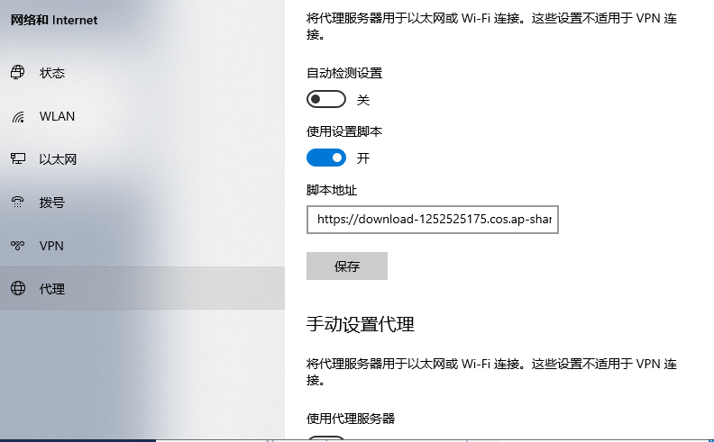

# MAC版本链接教程

**SSL VPN Windows登录方式**

第一步：双击secoclient-macosx-1.60.5.20.tar程序，出现图二所示，打开文件夹双击 SecoClientInstaller.pkg程序；

第六步：点击连接进行登录，并输入VPN用户名、密码，点击登录；

第七步：点击登录后，出现下图所示警告，点击更改设置，不勾选“阻塞到不可信服务器的连接”，并点击确定选项，下次启用将不再弹出警告窗口；

出现此气泡，就连接成功。

